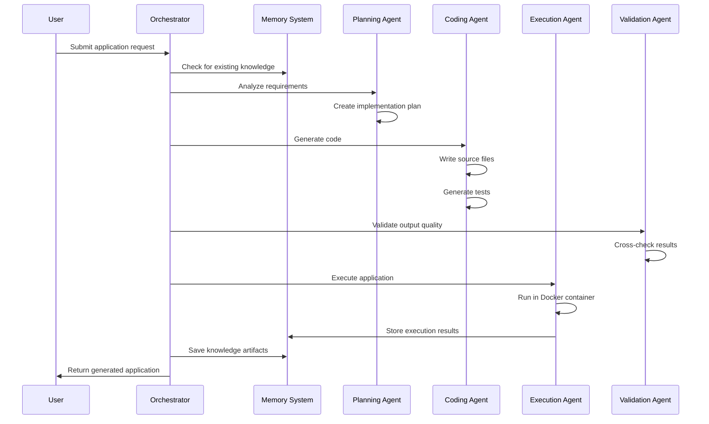

# Autonomous Coding Agent (unfinished)

An advanced AI-powered system that can autonomously generate complete applications from natural language descriptions. Built on top of a multi-agent architecture with specialized agents for planning, coding, execution, and validation.

## Features

- **Multi-Agent Architecture**: Orchestrated system with specialized AI agents
- **Autonomous Application Generation**: Create complete applications from descriptions
- **Docker Integration**: Secure code execution in isolated containers
- **Package Management**: Automatic dependency resolution and installation
- **Automated Testing**: Built-in test generation and execution
- **Project Scaffolding**: Complete project structure generation
- **Code Quality Analysis**: Automated code validation and quality scoring
- **Debugging Assistance**: Error detection and troubleshooting suggestions
- **Checkpoint System**: Progress tracking and recovery at each generation stage
- **Persistent Memory**: Learn from past generations and improve over time

## 💰 Cost-Saving Features

The system includes built-in cost optimization features for development and testing:

### Free Tier Testing Mode
- **Automatic Model Selection**: Uses free tier models when `USE_TESTING_MODE=true`
- **Cost-Effective Development**: Significantly reduced API costs during development
- **Capability Trade-off**: Slightly reduced model capabilities for substantial cost savings

### Free Tier Models (via OpenRouter):
1. **Orchestrator**: `qwen/qwen2.5-72b-instruct:free` (instead of paid Qwen2.5-1M)
2. **Coder**: `qwen/qwen3-coder:free` (instead of paid Qwen3-Coder-Plus)
3. **Vision**: `qwen/qwen2.5-vl-32b-instruct:free` (instead of paid models)
4. **Reasoning**: Claude 3.5 Sonnet (no free tier available, but very cost-effective)

### Configuration
Enable testing mode by setting `USE_TESTING_MODE=true` in your `.env` file.

## 🔄 API Provider Options

The system supports two ways to access AI models:

### Individual API Providers (Default)
- **Qwen API**: For Qwen2.5-1M Orchestrator and Qwen3 Coder
- **Anthropic API**: For Claude 3.5 Sonnet reasoning
- **OpenAI API**: For embeddings and memory system
- Requires separate API keys for each provider

### OpenRouter.ai (Recommended)
Single API gateway that provides access to all models:
- **Unified API**: Access to Qwen, Claude, and other models through one endpoint
- **Cost Savings**: Simplified billing and potentially better pricing
- **Model Flexibility**: Easy switching between different model providers
- **Rate Limit Management**: Centralized rate limit handling

To use OpenRouter:
1. Set `USE_OPENROUTER=true` in your .env file
2. Add your OpenRouter API key: `OPENROUTER_API_KEY=your_key_here`
3. The system will automatically route all model requests through OpenRouter

## System Architecture

The Autonomous Coding Agent consists of several specialized components:

1. **Orchestrator Agent** (Qwen2.5-1M): Coordinates all other agents and manages workflow
2. **Planning Agent** (Claude): Analyzes requirements and creates implementation plans
3. **Coding Agent** (Qwen3): Generates code based on specifications
4. **Execution Agent** (Enhanced): Executes code in Docker containers with full autonomy
5. **Validation Agent**: Validates output quality and correctness

### Agent Specializations

- **Qwen2.5-1M Orchestrator**: 1M token context window for complex task coordination
- **Claude Reasoning**: Advanced logical analysis and planning with LSTM numerical analysis
- **Qwen3 Coder**: Specialized code generation with quality assurance
- **Qwen2.5-VL Vision**: Image analysis for visual requirements (when needed)
- **Enhanced Execution**: Secure Docker-based code execution with full autonomy

## System Workflow

The Autonomous Coding Agent follows a sophisticated multi-stage workflow that leverages specialized AI agents and checkpoint-based progress tracking:

### 🔄 High-Level Workflow



### 🏗️ Autonomous Application Generation Process

The system follows these detailed steps when generating an application:

1. **Requirements Analysis**
   - Parse user description and requirements
   - Determine project type (web API, CLI tool, data processor, etc.)
   - Select appropriate technology stack
   - Resolve dependencies and frameworks

2. **Project Structure Creation**
   - Generate directory layout
   - Create configuration files
   - Set up build and deployment scripts
   - Initialize version control files

3. **Main Code Generation**
   - Generate primary application logic
   - Create core modules and components
   - Implement required functionality
   - Add error handling and logging

4. **Additional File Generation**
   - Create Dockerfile for containerization
   - Generate README with documentation
   - Create .gitignore and other config files
   - Set up CI/CD configuration

5. **Test Generation**
   - Create unit tests for core functionality
   - Generate integration tests
   - Set up test frameworks and runners
   - Define test data and fixtures

6. **Code Validation**
   - Check code quality and readability
   - Validate syntax and structure
   - Assess security considerations
   - Evaluate maintainability metrics

7. **Code Formatting**
   - Apply language-specific formatting rules
   - Ensure consistent code style
   - Optimize for readability

8. **Application Execution**
   - Execute in isolated Docker container
   - Install dependencies
   - Run generated application
   - Execute test suite
   - Capture execution results

### 📋 Checkpoint System

The system implements a comprehensive checkpoint mechanism that tracks progress at each stage:

Each checkpoint contains:
- **Stage Information**: What step was completed
- **Execution Data**: Time taken, resources used
- **Status**: Success/failure with error details
- **Artifacts**: Generated code, files, or results
- **Metadata**: Quality metrics, confidence scores

This enables:
- Progress tracking during long-running tasks
- Recovery from failures at the last successful checkpoint
- Debugging and analysis of the generation process
- Performance optimization based on historical data

### 🧠 Memory and Knowledge Management

The system uses a persistent vector database to store and retrieve knowledge:

1. **Knowledge Storage**
   - Successful code generations
   - Best practices and patterns
   - Common error solutions
   - Performance optimizations

2. **Knowledge Retrieval**
   - Search for similar tasks
   - Reuse proven solutions
   - Avoid repeated mistakes
   - Apply learned optimizations

3. **Continuous Learning**
   - Store successful patterns
   - Learn from failures
   - Improve over time
   - Share knowledge across tasks

## Installation

1. Clone the repository:
   ```bash
   git clone <repository-url>
   cd multi-agent-app
   ```

2. Create a virtual environment:
   ```bash
   python3 -m venv venv
   source venv/bin/activate  # On Windows: venv\Scripts\activate
   ```

3. Install dependencies:
   ```bash
   pip install -r multi_agent_system/requirements.txt
   ```

4. Set up environment variables:
   ```bash
   cp multi_agent_system/.env.example .env
   # Edit .env with your API keys
   ```

5. **Choose your configuration:**
   
   **For Testing/Development (Free Tier Models):**
   - Set `USE_TESTING_MODE=true` in your .env file
   - Set `USE_OPENROUTER=true` and add your OpenRouter API key
   - The system will automatically use free tier models to save costs
   
   **For Production (Full Capability Models):**
   - Set `USE_TESTING_MODE=false` (or remove the setting)
   - Choose between individual API keys or OpenRouter

6. Ensure Docker is installed and running:
   ```bash
   docker --version
   ```

## Usage

### Command Line Interface

Generate an application from a description:
```bash
python autonomous_coder.py "Create a web API that returns current weather data"
```

Run in interactive mode:
```bash
python autonomous_coder.py --interactive
```

Specify an application name:
```bash
python autonomous_coder.py --name "WeatherAPI" "Create a REST API for weather forecasts"
```

### Programmatic Usage

```python
from multi_agent_system.autonomous_app_generator import generate_autonomous_application

# Generate an application
result = await generate_autonomous_application(
    "Create a simple CLI tool that processes CSV files",
    "CSVProcessor"
)

if result.success:
    print(f"Application generated with {len(result.generated_files)} files")
    print(f"Quality score: {result.quality_metrics['overall']:.2%}")
    print(f"Checkpoints created: {len(result.checkpoints)}")
```

## Generated Application Structure

When an application is generated, it includes:

- Complete project structure with source files
- Dependency management (requirements.txt, package.json, etc.)
- Dockerfile for containerization
- Automated tests
- README documentation
- Proper .gitignore file
- Configuration files

## Testing

Run the autonomous coding tests:
```bash
python test_autonomous_coder.py
```

Run the checkpoint system tests:
```bash
python test_checkpoint_system.py
```

## Requirements

- Python 3.8+
- Docker Engine
- API keys for Qwen, Claude, and OpenAI
- At least 4GB RAM available for Docker containers

## Supported Languages

- Python (primary support)
- JavaScript/TypeScript
- Go
- (Extensible to other languages)

## Security

- Code execution occurs in isolated Docker containers
- No persistent changes to host system
- Resource limits enforced on containers
- Network isolation by default
- API key isolation and rate limiting

## Contributing

1. Fork the repository
2. Create a feature branch
3. Commit your changes
4. Push to the branch
5. Create a pull request

## License

MIT License - see LICENSE file for details.

## Acknowledgments

This system builds upon the Kilo code and Qwen CLI concepts, integrating multiple AI models and autonomous execution capabilities to create a powerful code generation system.
